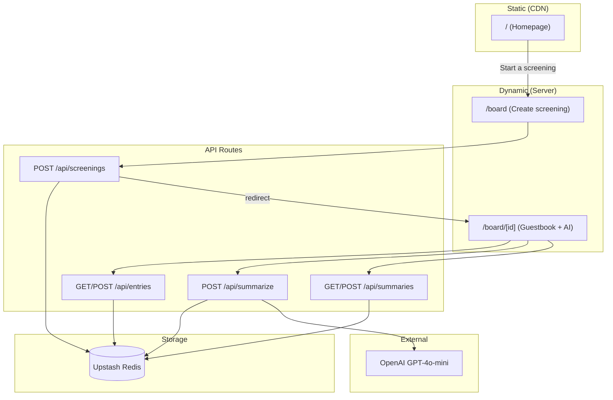

# AfterCredits

**When the credits roll, what did the room think?**

AfterCredits is a movie screening guestbook that captures audience reactions and uses AI to extract the signal. Start a screening, share the link, and everyone on that board can leave their thoughts and star ratings. AI summarizes the room's reaction into a concise "Audience Summary."

No accounts. No feeds. One shared board for one shared moment.

---

## Table of Contents

- [Overview](#overview)
- [Architecture](#architecture)
- [Tech Stack](#tech-stack)
- [Data Model](#data-model)
- [File Structure](#file-structure)
- [Decision Log](#decision-log)
- [What I'd Do Differently](#what-id-do-differently)
- [Local Setup](#local-setup)
- [Deployment](#deployment)

---

## Overview

### User Flow

1. **Homepage** — Marketing page explains the product. User clicks "Start a screening."
2. **Create screening** — Enter movie title → creates a unique board with shareable link.
3. **Board** — Share the link. Guests submit reactions (message + 1–5 stars). AI generates a streaming summary of the room's feedback.

### Key Differentiator

**Screening-scoped boards.** Each screening gets its own URL (`/board/{id}`). Entries and AI summary are scoped to that screening. The data model matches the narrative: "one shared moment" = one screening.

---

## Architecture



### Static vs Dynamic

| Route | Rendering | Why |
|-------|-----------|-----|
| `/` (Homepage) | **Static** | Pre-rendered at build, served from CDN. No database or user-specific data. |
| `/board` | **Dynamic** | Creates screenings; needs to write to DB and redirect. |
| `/board/[id]` | **Dynamic** | Fetches entries and summary from Redis on each request. Live data. |

---

## Tech Stack

| Layer | Choice |
|------|--------|
| Framework | Next.js 14 (App Router) |
| Styling | Tailwind CSS |
| Database | Upstash Redis (KV) |
| AI | Vercel AI SDK + OpenAI (gpt-4o-mini) |
| Deployment | Vercel |

---

## Data Model

### Screening

| Field | Type | Description |
|-------|------|--------------|
| `id` | string | UUID |
| `movieTitle` | string | Movie title for the screening |
| `createdAt` | string | ISO timestamp |

### Entry

| Field | Type | Description |
|-------|------|-------------|
| `id` | string | UUID |
| `screeningId` | string | Parent screening |
| `message` | string | Guest's reaction |
| `stars` | number | 1–5 rating |
| `createdAt` | string | ISO timestamp |

### Redis Keys

| Key | Type | Purpose |
|-----|------|---------|
| `screening:{id}` | string (JSON) | Screening metadata |
| `screening:{id}:entries` | list | Entry objects (JSON strings) |
| `screening:{id}:summary` | string | Cached AI summary |

---

## File Structure

```
app/
├── page.tsx                    # Marketing homepage (static)
├── layout.tsx                  # Root layout, fonts
├── globals.css                 # Tailwind + custom styles
├── components/
│   ├── AudienceSummary.tsx     # AI summary UI (streaming, client)
│   ├── CopyLinkButton.tsx      # Copy board URL
│   ├── Review.tsx              # Entry card display
│   └── Step.tsx                # How-it-works step
├── board/
│   ├── page.tsx                # "Start screening" form
│   ├── components/
│   │   └── StartScreeningForm.tsx
│   └── [id]/
│       └── page.tsx            # Board: form + entries + AI summary
└── api/
    ├── screenings/route.ts     # POST — create screening
    ├── entries/route.ts        # GET — list entries; POST — add entry
    ├── summarize/route.ts      # POST — streaming AI summary
    └── summaries/route.ts      # GET/POST — fetch/save summary

lib/
└── kv.ts                       # Redis: getScreening, createScreening, getEntries, addEntry, getSummary, saveSummary
```

---

## Decision Log

### Database: Upstash Redis

**Choice:** Upstash Redis (KV) instead of Postgres or another relational DB.

**Why:** Simple, fast to ship, and append-only fits the guestbook model. Upstash integrates cleanly with Vercel (serverless-friendly REST API). No connection pooling or schema migrations.

**Tradeoff:** Less flexible than Postgres for complex queries (e.g., "all screenings by user," full-text search). For this scope, KV is sufficient.

---

### Static vs Dynamic Rendering

**Choice:** Homepage is static (`force-static`); board is dynamic (`force-dynamic`).

**Why:** The homepage has no dynamic data—no DB calls, no user-specific content. Static = fastest load, best cache. The board needs fresh entries and summaries, so dynamic ensures users always see the latest data.

**Tradeoff:** Homepage content changes require a redeploy. Board is slightly slower than static (no CDN cache). For a guestbook, freshness matters more than sub-100ms TTFB.

---

### Single Global vs Per-Screening Boards

**Choice:** Per-screening boards. Each screening is a first-class entity; entries and summaries are scoped to `screeningId`.

**Why:** Conceptual coherence. "One shared moment" = one screening. Shareable links map 1:1 to boards. Matches the product narrative. A single global guestbook would mix reactions from different movies—noise.

**Tradeoff:** More Redis keys to manage. No global "all entries" view—by design.

---

### AI: Vercel AI SDK + Streaming

**Choice:** Vercel AI SDK with `streamText` and `useCompletion`. Summary appears token-by-token.

**Why:** Demo-friendly—streaming shows the model "thinking" in real time. Vercel-native tooling, minimal setup. `gpt-4o-mini` balances cost and quality for short summaries.

**Tradeoff:** More setup than a one-shot `fetch` to OpenAI. Worth it for the UX.

---

### Server vs Client Components

**Choice:** Board page is a Server Component; `AudienceSummary` and `CopyLinkButton` are Client Components.

**Why:** The board fetches screening, entries, and summary from Redis—server-side is ideal. `AudienceSummary` uses `useCompletion` (hooks, interactivity) and `CopyLinkButton` uses `navigator.clipboard`—both need the client. Minimal client JS; server does the heavy lifting.

**Tradeoff:** Need to think about the boundary. Streaming AI response is client-driven, so that component must be client. Form could be either; kept as server-rendered HTML for simplicity.

---

### Form POST + Redirect vs Client Fetch

**Choice:** Entry form uses traditional `method="POST"` and `action="/api/entries"` with server redirect.

**Why:** Simpler. Works without JavaScript. No client-side state for loading/error. Form submits, server redirects, user sees updated board.

**Tradeoff:** Full page reload. No optimistic updates. If the API returns JSON (e.g. 404), user sees raw JSON instead of a friendly error. Could convert to client-side `fetch` for better error handling and optimistic UX.

---

## What I'd Do Differently

### 1. Caching / Revalidation After New Entry

**Current:** Board fetches entries on every request. No cache invalidation.

**Improvement:** Use `revalidatePath` (or `revalidateTag`) in the entries POST handler after a successful add. Next.js would serve cached data until a new entry triggers revalidation. Reduces Redis reads for popular boards.

---

### 2. Optimistic Updates for Form Submission

**Current:** Form POSTs, server redirects, full page reload. User waits for the round-trip.

**Improvement:** Convert to client-side submit with `fetch`. Optimistically append the new entry to the UI before the response. On success, no flash; on failure, roll back and show error. Feels instant.

---

### 3. Pagination for Entries

**Current:** `lrange(0, -1)` fetches all entries. Fine for small screenings.

**Improvement:** If a board goes viral (100+ entries), paginate or virtualize. Redis `LRANGE` with offset/limit, or cursor-based pagination. Keeps the board performant at scale.

---

### 4. Real-Time Updates

**Current:** Board only updates on refresh. If two devices view the same board, Device A doesn't see Device B's new entry until manual refresh.

**Improvement:** Polling (SWR with `refreshInterval`) or push (Pusher/Ably) so all viewers see new entries as they arrive. Out of scope for MVP but a natural next step.

---

## Local Setup

### Prerequisites

- Node.js 18+
- npm (or pnpm/yarn)

### 1. Clone and Install

```bash
git clone <your-repo-url>
cd aftercredits_pro
npm install
```

### 2. Environment Variables

Create `.env.local` in the project root:

```env
# Upstash Redis (from console.upstash.com or Vercel Marketplace)
UPSTASH_REDIS_REST_URL="https://your-instance.upstash.io"
UPSTASH_REDIS_REST_TOKEN="your-token"

# OpenAI (for AI summary)
OPENAI_API_KEY="sk-..."
```

### 3. Run Development Server

```bash
npm run dev
```

Open [http://localhost:3000](http://localhost:3000).

### 4. Build for Production

```bash
npm run build
npm start
```

---

## Deployment

### Vercel

1. Push to GitHub.
2. Import the repo in [Vercel](https://vercel.com).
3. Add environment variables in Project Settings → Environment Variables:
   - `UPSTASH_REDIS_REST_URL`
   - `UPSTASH_REDIS_REST_TOKEN`
   - `OPENAI_API_KEY`
4. Deploy. Vercel will build and deploy on every push to `main`.

### One-Click Deploy

[](https://vercel.com/new/clone?repository-url=https://github.com/your-username/aftercredits_pro)

*(Update the repository URL after pushing to GitHub.)*

---

## License

MIT
