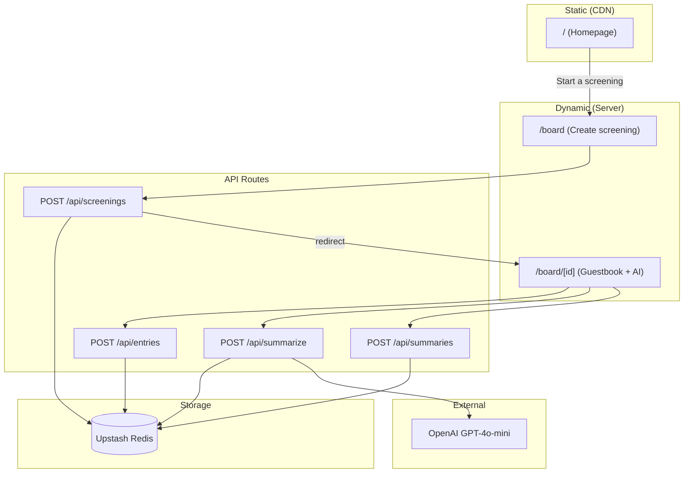

# Room Review

**When the credits roll, what did the room think?**

Room Review is a movie screening guestbook that captures audience reactions and uses AI to extract the signal. Start a screening, share the link, and everyone on that board can leave their thoughts and star ratings. AI summarizes the room's reaction into a concise "Audience Summary."

No accounts. No feeds. One shared board for one shared moment.

**[Live Site](https://aftercredits-one.vercel.app/)** · **[GitHub](https://github.com/timothychengg/vercel-takehome)**

---

## Table of Contents

- [Overview](#overview)
- [Architecture](#architecture)
- [Tech Stack](#tech-stack)
- [Data Model](#data-model)
- [File Structure](#file-structure)

---

## Overview

### User Flow

1. **Homepage** — Marketing page explains the product. User clicks "Start a screening."
2. **Create screening** — Enter movie title → creates a unique board with shareable link.
3. **Board** — Share the link. Guests submit reactions (message + 1–5 stars). AI generates a streaming summary of the room's feedback.

### Key Differentiator

**Screening-scoped boards.** Each screening gets its own URL (`/board/{id}`). Entries and AI summary are scoped to that screening. The data model matches the narrative: "one shared moment" = one screening.

---

## Architecture



### Static vs Dynamic

| Route | Rendering | Why |
|-------|-----------|-----|
| `/` (Homepage) | **Static** | Pre-rendered at build, served from CDN. No database or user-specific data. |
| `/board` | **Dynamic** | Creates screenings; needs to write to DB and redirect. |
| `/board/[id]` | **Dynamic** | Fetches entries and summary from Redis on each request. Live data. |

---

## Tech Stack

| Layer | Choice |
|------|--------|
| Framework | Next.js 14 (App Router) |
| Styling | Tailwind CSS |
| Database | Upstash Redis (KV) |
| AI | Vercel AI SDK + OpenAI (gpt-4o-mini) |
| Deployment | Vercel |

---

## Data Model

### Screening

| Field | Type | Description |
|-------|------|--------------|
| `id` | string | UUID |
| `movieTitle` | string | Movie title for the screening |
| `createdAt` | string | ISO timestamp |

### Entry

| Field | Type | Description |
|-------|------|-------------|
| `id` | string | UUID |
| `screeningId` | string | Parent screening |
| `message` | string | Guest's reaction |
| `stars` | number | 1–5 rating |
| `createdAt` | string | ISO timestamp |

### Redis Keys

| Key | Type | Purpose |
|-----|------|---------|
| `screening:{id}` | string (JSON) | Screening metadata |
| `screening:{id}:entries` | list | Entry objects (JSON strings) |
| `screening:{id}:summary` | string | Cached AI summary |

---

## File Structure

```
app/
├── page.tsx                    # Marketing homepage (static)
├── layout.tsx                  # Root layout, fonts
├── globals.css                 # Tailwind + custom styles
├── components/
│   ├── AudienceSummary.tsx     # AI summary UI (streaming, client)
│   ├── CopyLinkButton.tsx      # Copy board URL
│   ├── Review.tsx              # Entry card display
│   └── Step.tsx                # How-it-works step
├── board/
│   ├── page.tsx                # "Start screening" form
│   ├── components/
│   │   └── StartScreeningForm.tsx
│   └── [id]/
│       └── page.tsx            # Board: form + entries + AI summary
└── api/
    ├── screenings/route.ts     # POST — create screening
    ├── entries/route.ts        # GET — list entries; POST — add entry
    ├── summarize/route.ts      # POST — streaming AI summary
    └── summaries/route.ts      # GET/POST — fetch/save summary

lib/
└── kv.ts                       # Redis: getScreening, createScreening, getEntries, addEntry, getSummary, saveSummary
```

---

## License

MIT
